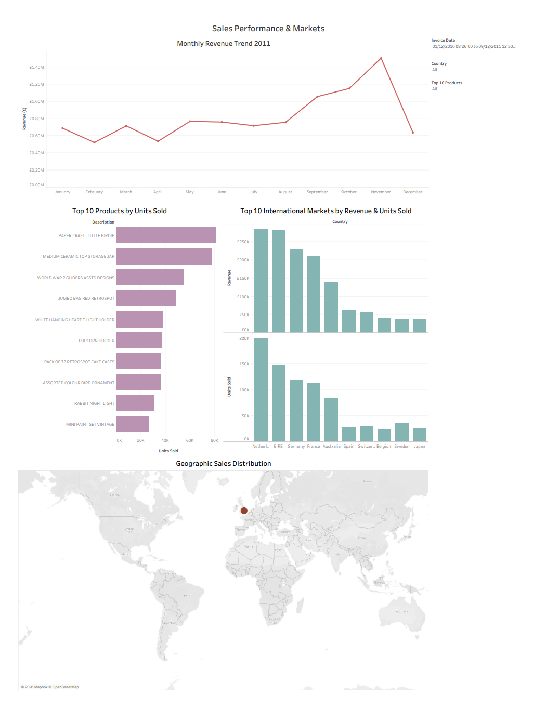
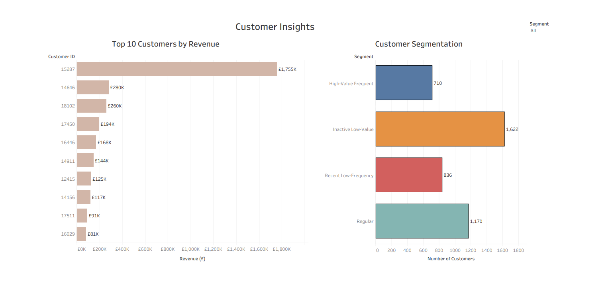
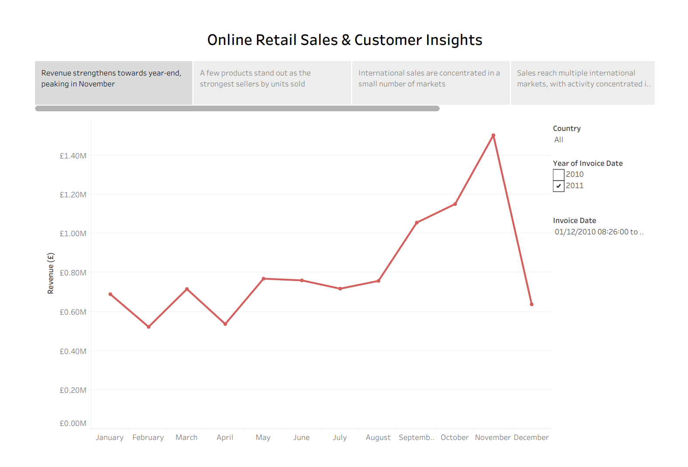

# 

# Online Retail Transaction Analysis

This project analyses online retail transaction data to identify patterns in sales performance, customer purchasing behaviour, product performance and geographic markets.

I followed an end-to-end analytics workflow using Python and Tableau, taking the data from raw transaction records through cleaning, exploratory and statistical analysis, machine learning and business-facing visualisation.

I also developed a K-Means customer segmentation model using Recency, Frequency and Monetary (RFM) behaviour. The findings were then communicated through interactive Tableau dashboards and a guided story to support decisions around sales performance, customer retention, product demand and international markets.

## Dataset Content

The project uses the Online Retail transactions dataset obtained from Kaggle.

The raw dataset contains **541,909 rows and 8 columns**:

- Invoice number
- Product stock code
- Product description
- Quantity purchased
- Invoice date and time
- Unit price
- Customer ID
- Customer country

The dataset covers transactions between **December 2010 and 9 December 2011**, meaning December 2011 represents a partial month.

During the ETL process, I investigated missing values, exact duplicates, cancelled transactions, invalid quantities and non-positive unit prices.

I also created a `Revenue` feature:

`Revenue = Quantity × UnitPrice`

After cleaning and validation, the final dataset contained **524,878 rows and 9 columns** and was exported as `Online_Retail_Cleaned.csv` for use in later stages.

## Business Requirements

The aim of the project was to turn the retailer's transaction data into useful information that could support sales, customer and market-related decisions.

The analysis focused on six business requirements:

1. **Understand overall sales performance and trends**
   - Analyse revenue and sales volume over time.

2. **Identify product performance**
   - Determine which products perform strongly using measures such as units sold, revenue and transaction frequency.

3. **Understand customer purchasing behaviour**
   - Identify high-value customers and differences in purchasing activity and value.

4. **Evaluate geographic market performance**
   - Compare revenue and sales volume across countries and identify important international markets.

5. **Segment customers based on purchasing behaviour**
   - Identify meaningful customer groups using recency, frequency and monetary value.

6. **Communicate insights to business stakeholders**
   - Present the main findings through interactive Tableau dashboards and a guided story.

## Hypothesis and how to validate?

### International vs UK Transaction Revenue

The exploratory analysis showed that the UK generated the majority of total revenue. However, I wanted to investigate whether individual UK transactions were also typically higher in value.

- **Null Hypothesis (H₀):** There is no statistically significant difference in transaction revenue between UK and international transactions.
- **Alternative Hypothesis (H₁):** There is a statistically significant difference in transaction revenue between UK and international transactions.

I used a significance level of **α = 0.05**.

Because transaction revenue was strongly right-skewed and the two groups were independent, I selected the non-parametric **Mann-Whitney U test**.

The test produced a p-value of approximately **$1.47 \times 10^{-83}$**, which was below 0.05. I therefore rejected the null hypothesis.

International transactions had a median transaction revenue of approximately **£427.53**, compared with approximately **£299.95** for UK transactions.

This suggests that although the UK generates substantially more total revenue, international transactions tend to have a higher typical transaction value.

## Project Plan

I structured the project into four main stages so that each stage produced reliable inputs for the next.

### 1. ETL and Data Cleaning

I inspected the raw dataset, investigated data quality issues, handled missing and invalid records, removed exact duplicates, created the `Revenue` feature and exported a validated cleaned dataset.

### 2. Exploratory and Statistical Analysis

I analysed overall business performance, monthly trends, products, customers and geographic markets. I also used descriptive statistics, probability, correlation and hypothesis testing to investigate patterns in more detail.

### 3. Machine Learning and Customer Segmentation

I created customer-level RFM features and prepared them for K-Means clustering. I evaluated different numbers of clusters using the Elbow Method and Silhouette Score before selecting and interpreting four customer segments.

### 4. Data Visualisation and Communication

I used Tableau to turn the main findings into two interactive dashboards and a guided story. The customer segmentation results produced in Python were also exported and incorporated into Tableau.

This created a clear workflow from **raw data → cleaned data → analysis → modelling → business communication**.

## Project Structure

The repository is organised around the main stages of the analysis:

    Online-Retail-Transaction-Analysis/
    │
    ├── assets/
    │   └── images/
    │       ├── customer-insights.png
    │       ├── sales-performance-markets.png
    │       └── tableau-story.png
    │
    ├── data/
    │   └── Online_Retail.csv
    │
    ├── jupyter_notebooks/
    │   ├── 01-ETL.ipynb
    │   ├── 02-Exploratory_Data_Analysis.ipynb
    │   └── 03-Machine_Learning.ipynb
    │
    ├── outputs/
    │   ├── Online_Retail_Cleaned.csv
    │   └── customer_segmentation_results.csv
    │
    ├── tableau/
    │   └── online_retail_dashboard.twb
    │
    ├── .gitignore
    ├── README.md
    └── requirements.txt

I separated the work across three notebooks so that each stage has a clear purpose. Outputs from earlier stages are reused in later stages rather than repeating the same processing.

## The rationale to map the Business Requirements to the Data Visualisations

I designed the Tableau visualisations around the business requirements so that each visual answers a specific question.

| Business Requirement | Visualisation | Rationale |
|---|---|---|
| Understand sales performance and trends | Monthly Revenue Trend | A line chart makes changes in revenue over time easy to identify. |
| Identify product performance | Top 10 Products by Units Sold | A ranked bar chart clearly compares the strongest-selling products. |
| Understand customer behaviour | Top 10 Customers by Revenue | Highlights the customers contributing the most revenue. |
| Evaluate geographic markets | Top 10 International Markets and Geographic Sales Distribution | Ranked comparisons show leading markets while the map communicates geographic reach. |
| Segment customers | Customer Segmentation | Shows the size of each K-Means customer group in a business-friendly format. |
| Communicate findings | Tableau dashboards and Story | Provides both interactive exploration and a guided route through the main insights. |

Interactive filters were included where appropriate so users can explore the results by factors such as date, country, product and customer segment.

## Analysis Techniques Used

### Data Cleaning and Feature Engineering

I investigated missing values, duplicates and unusual transaction records before deciding how they should be handled.

Exact duplicates were removed to prevent transactions from being counted more than once. Cancelled transactions, negative quantities and non-positive unit prices were investigated before being excluded from the positive-sales analysis.

I did not automatically remove every extreme value. Where high-value transactions appeared to be genuine purchases, I retained them because removing them could distort actual sales and customer behaviour.

### Exploratory Data Analysis

I used descriptive statistics and visualisations to investigate:

- Overall business performance
- Monthly trends
- Product performance
- Customer behaviour
- Geographic markets
- Transaction distributions
- Relationships between variables

Because several financial measures were strongly right-skewed, I considered medians alongside means.

I also used both Pearson and Spearman correlations when examining the relationship between quantity and revenue.

### Statistical Analysis

I used probability analysis and hypothesis testing to investigate patterns identified during EDA.

For the UK and international revenue comparison, I selected the Mann-Whitney U test because the transaction revenue distributions were strongly skewed and the groups were independent.

I interpreted the statistical result alongside descriptive measures rather than relying on the p-value alone.

### Machine Learning

I approached customer segmentation as an **unsupervised learning problem** because no predefined customer segment labels existed.

I engineered:

- **Recency** – days since the customer's most recent purchase
- **Frequency** – number of unique transactions
- **Monetary** – total customer revenue

I selected K-Means because the features were numerical and the aim was to identify customers with similar purchasing behaviour.

The RFM features were transformed and standardised before clustering because they were skewed and measured on different scales.

I evaluated different values of K using the **Elbow Method** and **Silhouette Score**.

Although K=2 produced the highest Silhouette Score, I selected four clusters because the Elbow Method also supported approximately four to five clusters and four produced more detailed and useful customer groups.

The final model achieved a Silhouette Score of approximately **0.337**, showing moderate cluster separation. I therefore treated the segments as a useful decision-support tool rather than perfectly separated customer classifications.

The final segments were:

- **High-Value Frequent**
- **Regular**
- **Recent Low-Frequency**
- **Inactive Low-Value**

A limitation is that the model uses RFM behaviour alone. Alternative algorithms or additional customer features could be explored in future.

### Use of Generative AI

Generative AI was used as a supporting tool throughout the project.

**ChatGPT** supported project planning, explanations of unfamiliar statistical and machine learning concepts, code troubleshooting, analytical reasoning and reviewing how findings were communicated.

**GitHub Copilot** was used within Visual Studio Code for inline code suggestions and assistance completing Python syntax while developing the notebooks.

I reviewed, tested and adapted AI-generated suggestions before using them. The final analytical decisions and conclusions were based on the results produced from the dataset.

## Dashboard Design

I created two interactive dashboards and one guided Tableau Story, separating sales and market performance from customer analysis to avoid overcrowding a single dashboard.

### Sales Performance & Markets

This dashboard includes:

- Monthly Revenue Trend
- Top 10 Products by Units Sold
- Top 10 International Markets by Revenue and Units Sold
- Geographic Sales Distribution
- Interactive filters

It brings together the main findings around when, what and where the retailer is selling.

### Customer Insights

This dashboard includes:

- Top 10 Customers by Revenue
- Customer Segmentation
- Segment filtering

I incorporated the customer segmentation results produced in Python so that the machine learning output could be explored in a business-facing format.

### Online Retail Sales & Customer Insights Story

I created the Tableau Story to guide users through the main findings in a structured sequence, covering sales trends, products, international markets, high-value customers and customer segmentation.

## Unfixed Bugs

There are no known unfixed bugs in the project at the time of submission.

## Development Roadmap

### Challenges and Learning

One of the main things I learned was that unusual data should not automatically be removed. Investigating negative quantities and extreme transactions helped me distinguish between genuine business behaviour and records that were unsuitable for the analysis.

The statistical analysis also developed my understanding of choosing methods based on the characteristics of the data rather than simply applying a test.

Customer segmentation was the area where I developed the most new knowledge. I learned how to create RFM features, prepare them for a distance-based algorithm and evaluate different cluster solutions.

The difference between the K=2 Silhouette result and the four-cluster business interpretation also showed me that model evaluation is not always about selecting one metric blindly. I had to consider both mathematical performance and the usefulness of the result.

Finally, Tableau helped me develop the communication side of analytics by making me decide which findings mattered most and how they could be presented clearly to a non-technical audience.

### Future Development

If I continued the project, I would compare K-Means with alternative clustering algorithms and explore additional customer features beyond RFM.

I also want to continue developing my statistical and machine learning knowledge so that I become more confident in independently selecting and comparing analytical methods.

The project reinforced that producing a result is only one part of analytics. I also need to understand why I used a method, recognise its limitations and explain what the result means for the business.

## Deployment

The interactive visualisations were published using Tableau Public.

The full Tableau workbook, including the worksheets, two dashboards and guided story, is available here:

[View the Online Retail Transaction Analysis Tableau Workbook](https://public.tableau.com/views/OnlineRetailTransactionAnalysis_17877013634800/OnlineRetailSalesCustomerInsights?:language=en-GB&:sid=&:redirect=auth&:display_count=n&:origin=viz_share_link)

## Main Data Analysis Libraries

- **Pandas** – data loading, cleaning, transformation, aggregation and analysis.
- **NumPy** – numerical operations and transformations.
- **Matplotlib** – exploratory and statistical visualisations.
- **Seaborn** – distributions and relationship visualisations.
- **Plotly** – interactive visualisations for international market revenue and sales volume analysis.
- **SciPy** – Mann-Whitney U hypothesis testing.
- **Scikit-learn** – preprocessing, K-Means clustering and Silhouette Score evaluation.
- **Tableau** – interactive dashboards and the guided story.

## Credits

### Data

The dataset used for this project was obtained from Kaggle:

[Online Retail transactions Dataset – Kaggle](https://www.kaggle.com/datasets/abhishekrp1517/online-retail-transactions-dataset)

### Content and Learning Resources

Code Institute course material supported my learning throughout the project, particularly around statistical analysis, machine learning and the overall data analytics workflow.

Official documentation for the libraries and tools used was also referenced where appropriate.

### Generative AI

ChatGPT was used to support planning, learning, troubleshooting and reviewing analytical explanations.

GitHub Copilot was used for inline Python code suggestions within Visual Studio Code.

AI-assisted suggestions were reviewed, tested and adapted before being incorporated into the project.